## CI/CD Assignment 1

### Github repository: ` https://github.com/kinleyp06/Kinley-Pem_02250354_DSO101_A1.git`
---

## Aim

To build and deploy a full-stack To-Do app using Docker containers and Render cloud platform.

---

## Objectives

- Create To-Do app with CRUD operations
- Use environment variables for config
- Build Docker images (tag with student ID: 02250354)
- Push images to Docker Hub
- Deploy on Render.com
- Setup auto-deploy from GitHub

---

## Technologies Used

| Component | Technology |
|-----------|------------|
| Frontend | React + Vite |
| Backend | Node.js + Express |
| Database | PostgreSQL |
| Container | Docker |
| Registry | Docker Hub |
| Cloud | Render.com |
| HTTP Client | Axios |

---

## Theory

**CI/CD**: Automates building, testing, and deploying code when you push to GitHub.

**Docker**: Packages your app with all dependencies into a lightweight container that runs anywhere.

**Environment Variables**: Store config data (DB passwords, API URLs) outside code. Never commit `.env` to Git.

---

## Folder Structure

| | | |
|-|-|-|
| 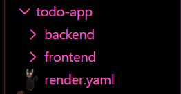 | 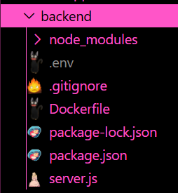 | 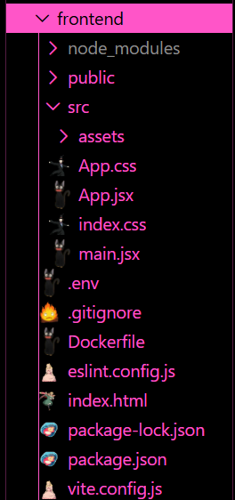 |
---

## Setup Steps

### 1. Create Project

```bash
mkdir todo-app
cd todo-app
mkdir backend frontend
```

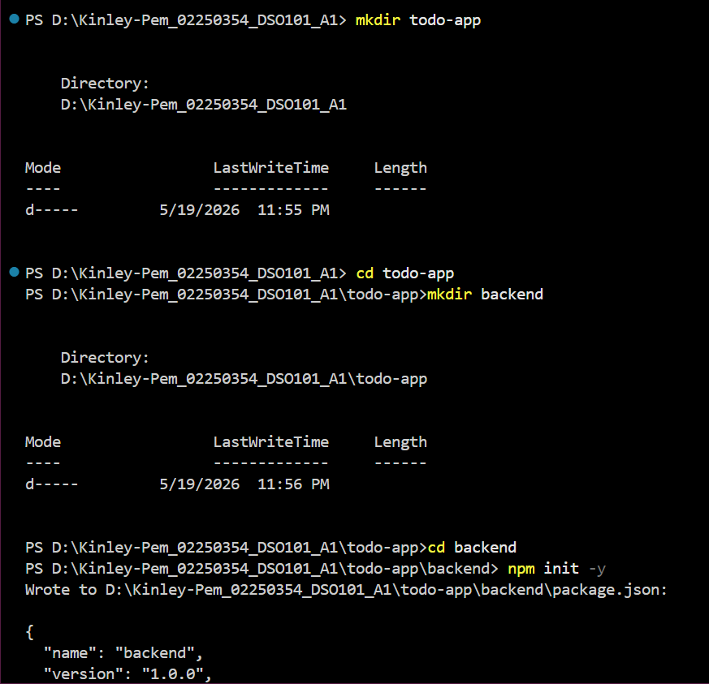
### 2. Setup Backend

```bash
cd backend
npm init -y
npm install express cors dotenv mongoose
npm install nodemon --save-dev
```

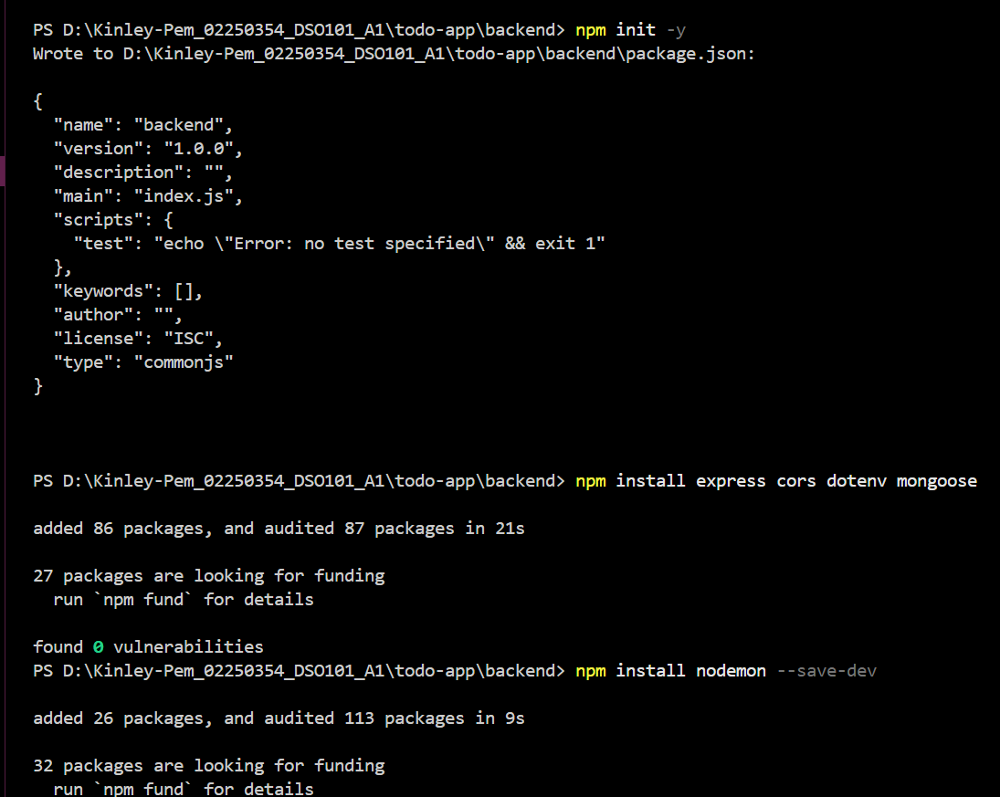
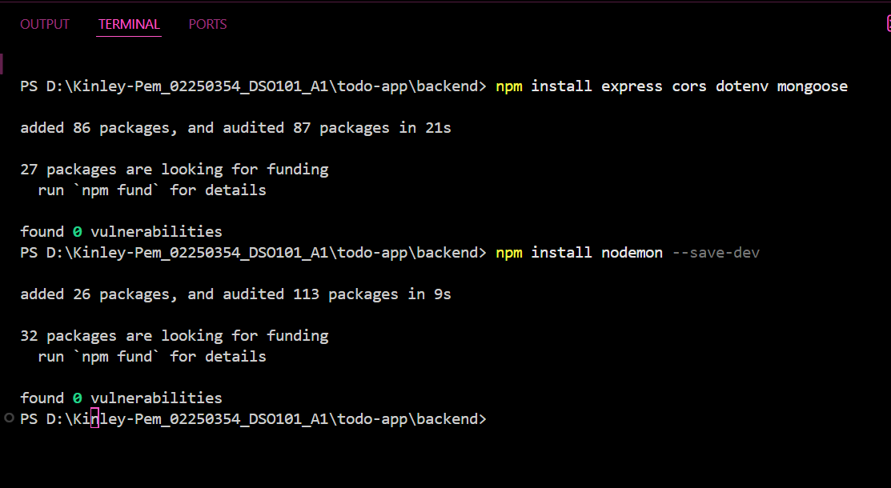

### 3. Setup Frontend

```bash
cd ../frontend
npm create vite@latest . -- --template react
npm install
npm install axios
```

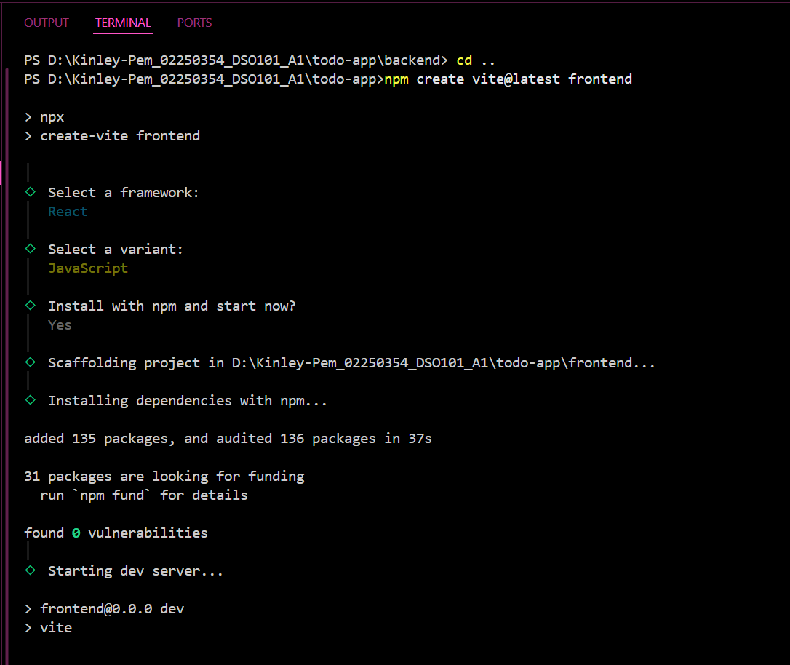
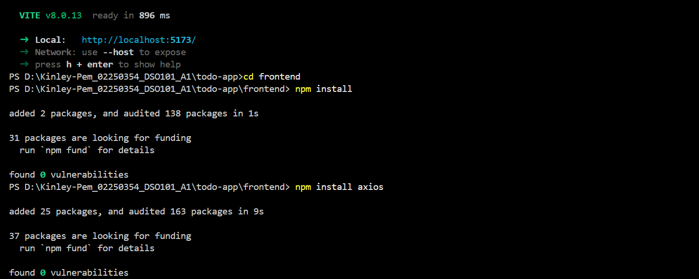

### 4. Run Locally

**Backend:**
```bash
npm run dev
```
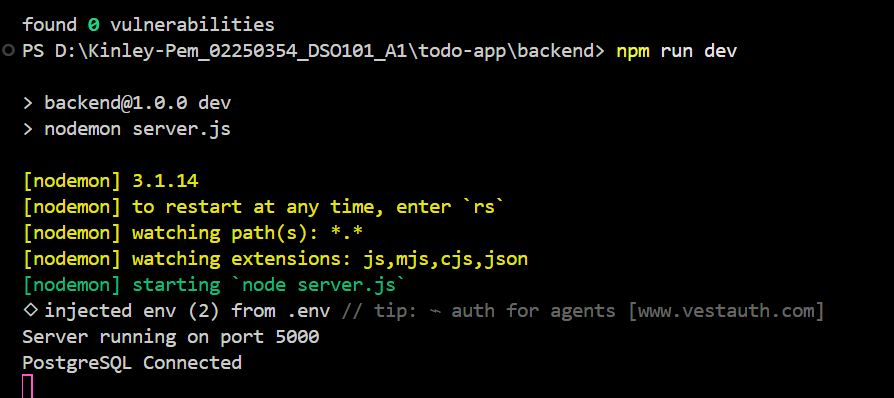
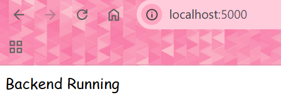

**Frontend:**
```bash
npm run dev
```
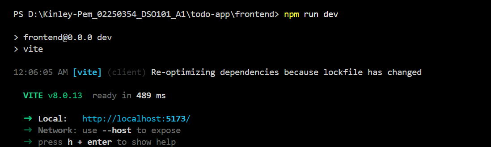
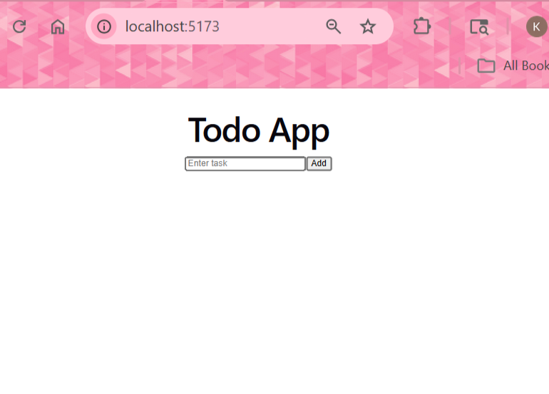

### 5. Environment Config

**Backend `.env`:**
```
PORT=5000
DB_HOST=your-db-host
DB_USER=db_user
DB_PASSWORD=your-password
DB_NAME=todo-db
DB_PORT=5432
```

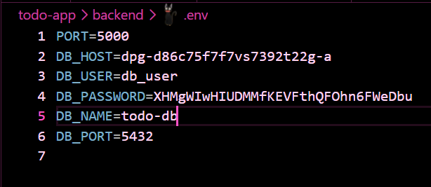

**.gitignore:**
```
node_modules
.env
```
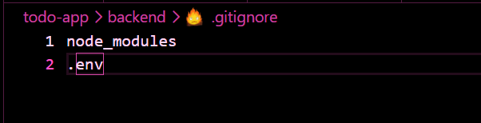

---

## Docker Setup

### Build Backend Image

```bash
docker build -t kinleypem/be-todo:02250354 .
```
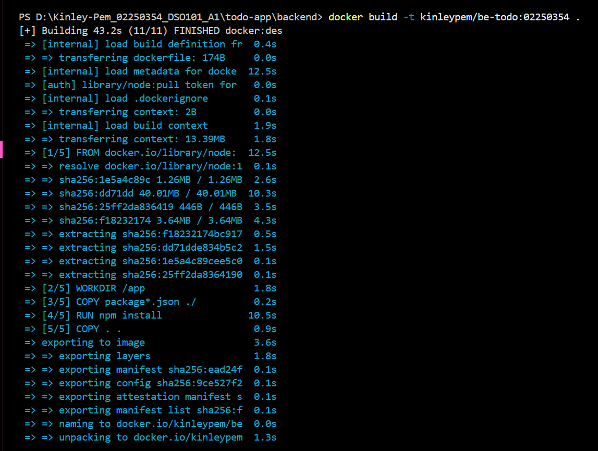

### Build Frontend Image

```bash
docker build -t kinleypem/fe-todo:02250354 .
```
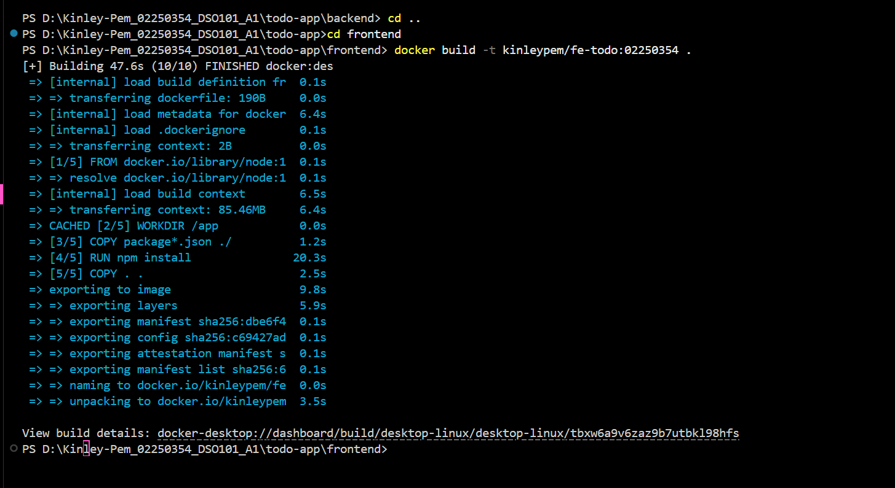

### Login to Docker Hub

```bash
docker login
```
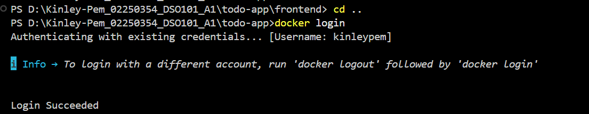

### Push Images

```bash
docker push kinleypem/be-todo:02250354
docker push kinleypem/fe-todo:02250354
```
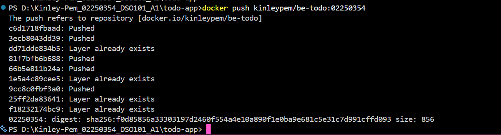
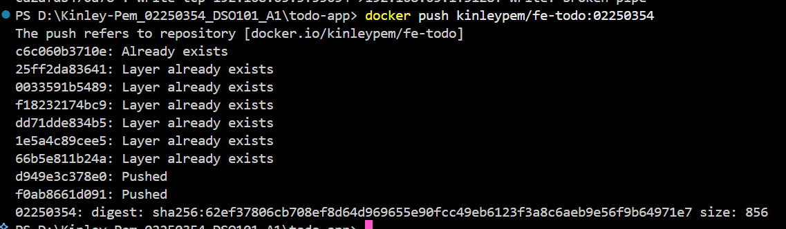

### Verify Images

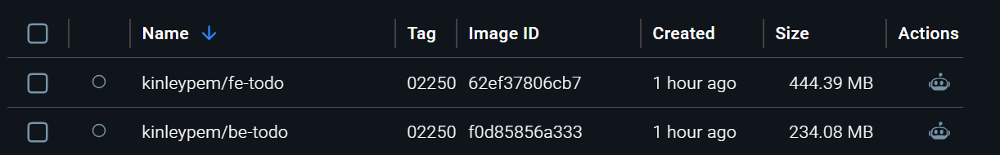
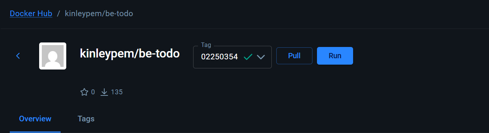
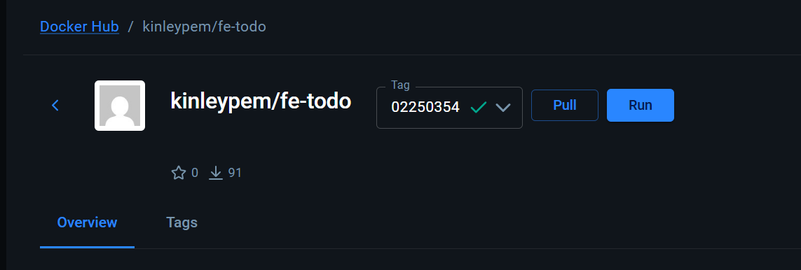

---

## Deploy on Render

### 1. Create PostgreSQL Database

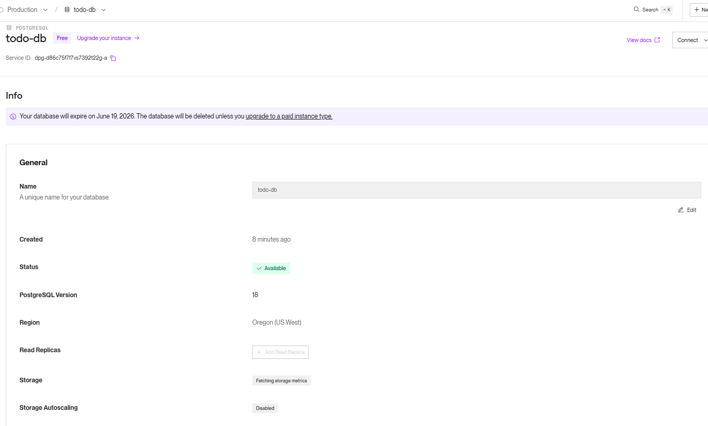

**Connection Details:**
- Host: `dpg-d86c75f7f7vs7392t22g-a`
- Port: `5432`
- User: `db_user`
- Password: `[hidden]`

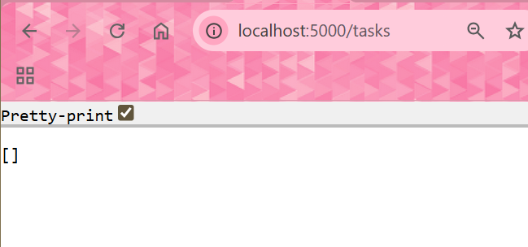

### 2. Deploy Backend (Image-based)

- New Web Service → Existing Image
- Image: `kinleypem/be-todo:02250354`
- Add env vars from Render dashboard

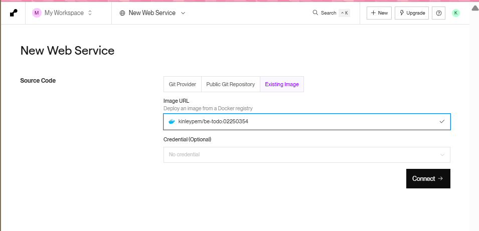
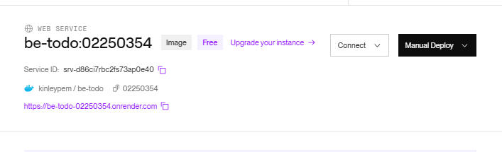

### 3. Set Environment Variables on Render

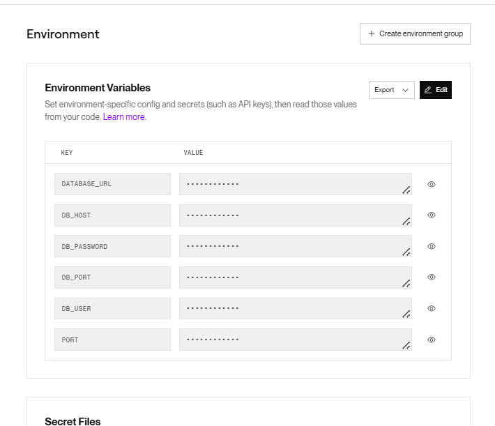

### 4. Verify Deployment

Backend live:
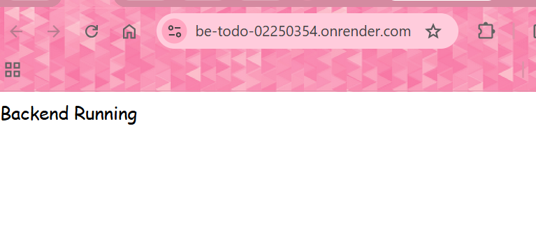

---

## Auto-Deploy Setup (Part B)

### render.yaml Blueprint

```yaml
services:
  - type: web
    name: be-todo
    env: docker
    dockerfilePath: ./backend/Dockerfile
    envVars:
      - key: DB_HOST
        value: your-render-db-host
      - key: PORT
        value: 5000

  - type: web
    name: fe-todo
    env: docker
    dockerfilePath: ./frontend/Dockerfile
    envVars:
      - key: REACT_APP_API_URL
        value: https://be-todo.onrender.com
```

**How it works:**
1. Push code to GitHub
2. Render detects changes
3. Auto-builds new Docker images
4. Auto-deploys to production

---

## API Endpoints

| Method | Endpoint | Description |
|--------|----------|-------------|
| GET | `/tasks` | Get all tasks |
| POST | `/tasks` | Create task |
| PUT | `/tasks/:id` | Update task |
| DELETE | `/tasks/:id` | Delete task |

---

## Live URLs

| Service | URL |
|---------|-----|
| Backend API | `https://be-todo-02250354.onrender.com` |
| Frontend App | `https://fe-todo-02250354.onrender.com` |

---

## Errors & Fixes

| Error | Cause | Fix |
|-------|-------|-----|
| `Invalid scheme` | Wrong DB connection string | Use proper PostgreSQL URL format |
| `MongoParseError` | Used MongoDB instead of PostgreSQL | Switched to Render PostgreSQL |
| Module not found | Missing dependencies | Run `npm install` |
| Port already in use | Another process on port 5000 | Change PORT in .env |

---

## Commands Summary

```bash
# Development
npm run dev          # Start dev server

# Docker
docker build -t name:tag .     # Build image
docker push name:tag           # Push to registry
docker images                  # List images

# Git
git add .
git commit -m "message"
git push origin main
```

---

## Conclusion

- Built working To-Do app with React + Node.js  
- Created Docker images tagged with student ID  
- Pushed images to Docker Hub  
- Deployed backend on Render.com  
- Configured PostgreSQL database  
- Setup automated deployment blueprint  

**Key takeaways:**
- Containers ensure consistency across environments
- Environment variables keep secrets safe
- CI/CD automates the deployment pipeline
- Render simplifies cloud deployment

